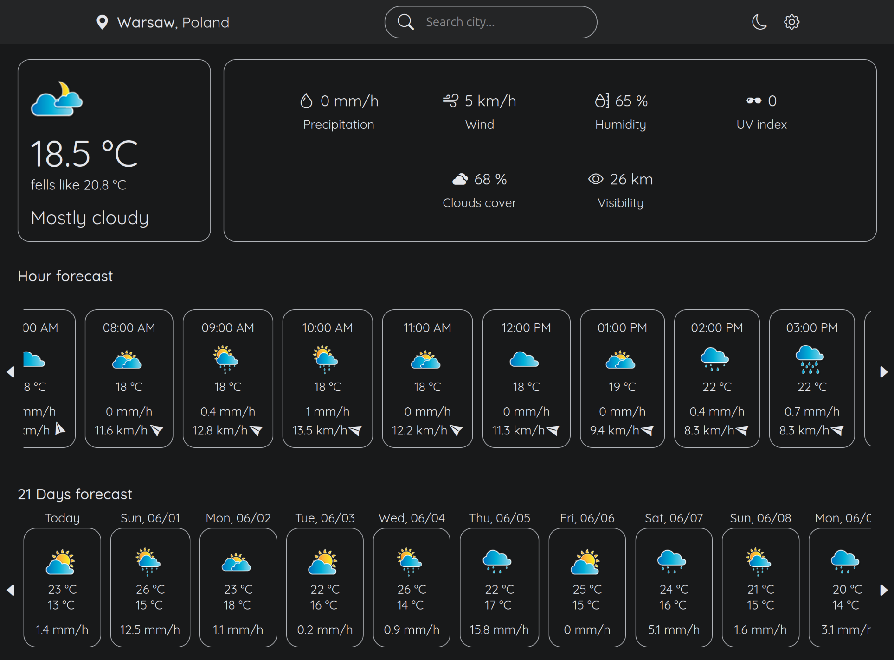
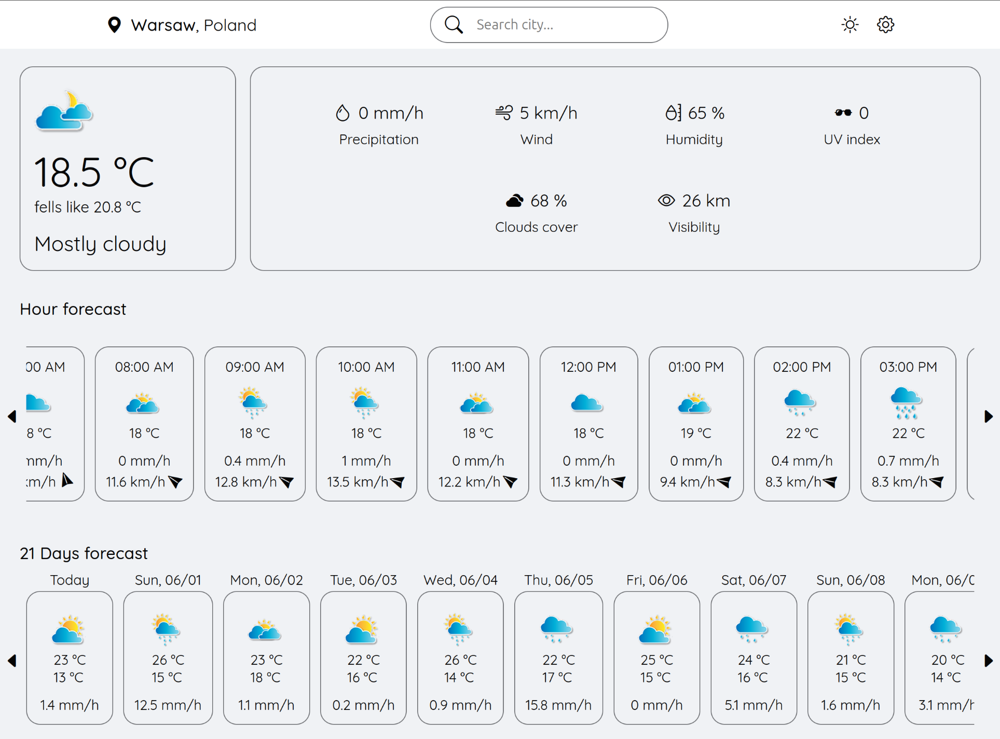

# 🌦️ React Weather App

A modern and user-friendly weather forecast app built with **React** and powered by the [AI Weather by Meteosource API](https://rapidapi.com/MeteosourceWeather/api/ai-weather-by-meteosource). This app allows users to search for any city and view:

- Current weather conditions
- Hourly weather forecasts
- A detailed 21-day daily forecast

The app features a **dark/light theme toggle**, unit switching (Celsius/Fahrenheit, metric/imperial), and a clean, responsive interface.

## 📷 Screenshots




## 🔧 Setup Instructions

### 1. Clone the Repository
```bash
cd react-weather-app
git clone https://github.com/Kostya20079/weather-app.git
```

### 2. Install Dependencies
```bash
npm install
```

### 3. Set Up Environment Variables
Create a .env file in the root of the project and add the following:
```ini
VITE_WEATHER_ICONS_URL="/weather_icons"
VITE_WEATHER_API_KEY="your_api_key_here"
```
> You can get your API key from [Meteosource on RapidAPI](https://rapidapi.com/MeteosourceWeather/api/ai-weather-by-meteosource).

### 4. 📁 Weather Icons Setup
Make sure to extract the provided `weather_icons.zip` file into your project’s `/public/weather_icons` directory.


### 5. Run the App
```bash
npm run start
```

## 🛠 Tech Stack

- React – Frontend framework
- Vite – Fast build tool
- CSS/SCSS – Styling
- Meteosource API – Weather data
- LocalStorage – Persisting theme and settings
